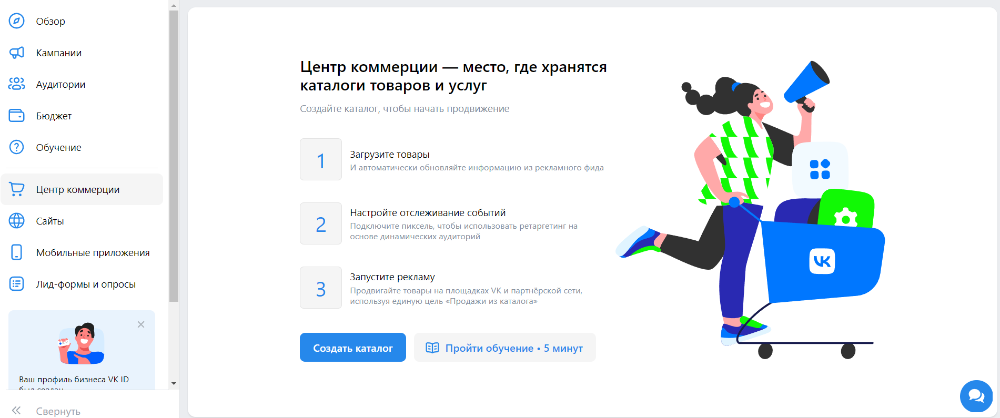
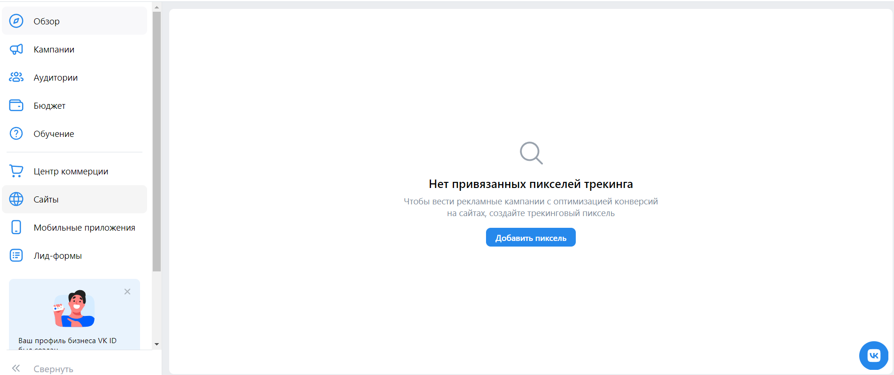
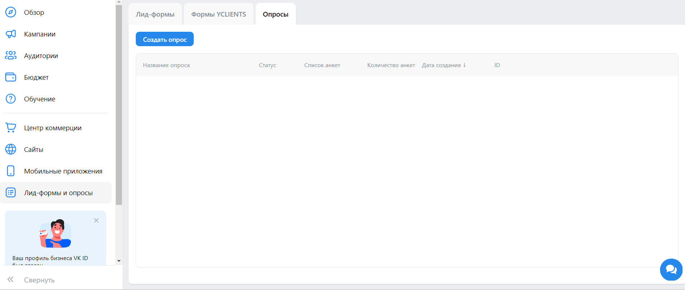

# Домашнее задание №3
## Каталоги
Ссылка: https://ads.vk.com/hq/ecomm/catalogs

### Примечание
В сообществе должно быть не менее трех товаров, чтобы создать каталог.

### Позитивные
Для проверки корректного создания каталога сообщества проверяем его название и период обновления. 
Можно захардкоить какие-то конкретные элементы каталога сайта и проверять, что он правильно загрузился, но это понижает устойчивость тестов в виду возможного изменения каталога без нашего времени.
Далее удаляем каталог.

- Создать каталог. Фид или сообщество. Создаем с параметрами:
    - Название - случайное название
    - Ссылка на фид или сообщество - https://vk.com/gangperm
    - Период обновления - "Ежедневно"

- Создать каталог. Фид или сообщество. Создаем с параметрами:
    - Название - случайное название
    - Ссылка на фид или сообщество - https://vk.com/gangperm
    - Период обновления - "1 час"

Для проверки корректного создания каталога из файла проверяем его название и поиском по товарам проверяем наличие товаров из файла каталога.
Далее удаляем каталог.

- Создать каталог. Вручную. Создаем с параметрами:
    - Название - случайное название
    - Категория фида - "Услуги"
    - Файл фида - шаблон фида "Услуги"

- Создать каталог. Вручную. Создаем с параметрами:
    - Название - случайное название
    - Категория фида - "Авто"
    - Файл фида - шаблон фида "Авто"

- Создать каталог. Вручную. Создаем с параметрами:
    - Название - случайное название
    - Категория фида - "Авиарейсы"
    - Файл фида - шаблон фида "Авиарейсы"

- Создать каталог. Вручную. Создаем с параметрами:
    - Название - случайное название
    - Категория фида - "Товары"
    - Файл фида - шаблон фида "Товары"

- Создать каталог. Вручную. Создаем с параметрами:
    - Название - случайное название
    - Категория фида - "Гостиницы"
    - Файл фида - шаблон фида "Гостиницы"

- Создать каталог. Вручную. Создаем с параметрами:
    - Название - случайное название
    - Категория фида - "Недвижимость"
    - Файл фида - шаблон фида "Недвижимость"

### Негативные
- Создать каталог. Фид или сообщество. Неверная ссылка. Появляется ошибка "Необходмо указать протокол http(s)"

- Создать каталог. Фид или сообщество. Ссылка ведущая не на сообщество. Появляются различные ошибки, начиная с "Неверный формат файла" и заканчивая "Не удалось выполнить запрос по HTTP", из-за чего стоит проверять факт какой-либо ошибки.

- Создать каталог. Фид или сообщество. Ссылка ведущая на сообщество с менее чем 3 товарами или услугами - https://vk.com/lovebmstu. Появляется ошибка "В этом сообществе недостаточно товаров или услуг".

## Сайты

### Примечание
В тестах, где выполняются какие-то операции над пикселями, которые уже должны быть находится в списке пикселей, сначала будут создаваться новые пиксели, затем над ними будут выполняться операции, после чего пиксели будут удаляться.

Ссылка: https://ads.vk.com/hq/pixels

- Сайты. Добавить пиксель. Ввод корректного доменного имени, для которого ранее не был создан пиксель. Добавить пиксель. Открывается модальное окно с сообщением "Создан ID пикселя". Закрыть. Пиксель появляется в списке со статусом "Данные не поступают".

- Сайты. Добавить пиксель. ID пикселя. Ввод корректного ID пикселя и Email владельца. Запросить доступ. Открывается модальное окно "Доступ к пикселю запрошен". Нажать кнопку "Отлично" или закрыть окно на крестик. Пиксель появляется в списке со статусом "Доступ запрошен".

- Сайты. Добавить пиксель. Ввод корректного доменного имени, для которого ранее был создан 1 пиксель. Запросить доступ к пикселю. Ввод верного email. Запросить доступ. Открывается модальное окно "Доступ к пикселю запрошен". Нажать кнопку "Отлично" или закрыть окно на крестик. Пиксель появляется в списке со статусом "Доступ запрошен".

- Сайты. Добавить пиксель. Ввод корректного доменного имени, для которого ранее было создано 2 и более пикселей. Запросить доступ к пикселю. Выбор пикселя. Ввод верного email. Запросить доступ. Открывается модальное окно "Доступ к пикселю запрошен". Нажать кнопку "Отлично" или закрыть окно на крестик. Пиксель появляется в списке со статусом "Доступ запрошен".

- Сайты. Выпадающее меню на три точки. Переименовать. Ввод нового названия. Изменить. Перезагрузить страницу. Название пикселя обновляется.

- Сайты. Выпадающее меню на три точки. Переименовать. Ввод нового названия. Отмена. Перезагрузить страницу. Название пикселя не меняется.

- Сайты. Выпадающее меню на три точки. Переименовать. Ввод нового названия. Закрыть. Перезагрузить страницу. Название пикселя не обновляется.
 
- Сайты. Выпадающее меню на три точки. Удалить пиксель. Удалить. Пиксель пропадает из списка.

- Сайты. Выпадающее меню на три точки. Удалить пиксель. "Отмена" или закрыть окно. Пиксель остается в списке.

- Сайты. Поиск. Ввод имени пикселя из списка пикселей. Пиксель найден.

- Сайты. Поиск. Ввод подстроки имени пикселя из списка пикселей. Пиксель найден.

- Сайты. Поиск. Ввод ID пикселя из списка пикселей. Пиксель найден.

- Сайты. Поиск. Ввод подстроки ID пикселя из списка пикселей. Пиксель найден.

- Сайты. Поиск. Ввод имени отсутствующего в списке пикселей. Ничего не найдено.

## Опросы
Ссылка: https://ads.vk.com/hq/leadads/surveys

### Примечание
После прогона теста - опрос удаляется, чтобы не изменять состояние после работы тестов.

### Позитивные кейсы

Простая проверка:
- Создать опрос. Оформление. С параметрами:
  - Логотип - любой загруженный логотип
  - Название - "название" + рандом
  - Заголовок - "заголовок" + рандом
  - Описания опроса - "описание" + рандом
- Создать опрос. Вопросы. С параметрами:
  - Текст вопроса - "Вопрос1"
  - Первый ответ - "ответ1"
  - Второй ответ - "ответ2"
  - Тип вопроса "Несколько из списка"
  - Стандартный вариант ответа "Другое (свой вариант)"
- Создать опрос. Результат. С параметрами: 
  - Заголовок - "заголовок" + рандом
  - Описание - "описание" + рандом
  - Ссылка - нет ссылки

Проверка свободной формы:
- Создать опрос. Оформление. С параметрами:
  - Логотип - любой загруженный логотип
  - Название - "название" + рандом
  - Заголовок - "заголовок" + рандом
  - Описания опроса - "описание" + рандом
- Создать опрос. Вопросы. С параметрами:
  - Текст вопроса - "Вопрос1"
  - Первый ответ - "ответ1"
  - Второй ответ - "ответ2"
  - Тип вопроса "Ответ в свободной форме"
  - Стандартный вариант ответа "Другое (свой вариант)"
- Создать опрос. Результат. С параметрами: 
  - Заголовок - "заголовок" + рандом
  - Описание - "описание" + рандом
  - Ссылка - нет ссылки

Проверка шкалы:
- Создать опрос. Оформление. С параметрами:
  - Логотип - любой загруженный логотип
  - Название - "название" + рандом
  - Заголовок - "заголовок" + рандом
  - Описания опроса - "описание" + рандом
- Создать опрос. Вопросы. С параметрами:
  - Текст вопроса - "Вопрос1"
  - Первый ответ - "ответ1"
  - Второй ответ - "ответ2"
  - Тип вопроса "Шкала"
  - Ответ из шаблона - "Другое (свой вариант)"
- Создать опрос. Результат. С параметрами: 
  - Заголовок - "заголовок" + рандом
  - Описание - "описание" + рандом
  - Ссылка - нет ссылки

Проверка с добавлением вопроса и ответа:
- Создать опрос. Оформление. С параметрами:
  - Логотип - любой загруженный логотип
  - Название - "название" + рандом
  - Заголовок - "заголовок" + рандом
  - Описания опроса - "описание" + рандом
- Создать опрос. Вопросы. С параметрами:
  - Текст вопроса - "Вопрос1"
  - Первый ответ - "ответ1"
  - Второй ответ - "ответ2"
  - Тип вопроса - "Несколько из списка"
  - Ответ из шаблона - "Ничего из этого"
  - Добавить вопрос:
    - Текст вопроса - "Вопрос2"
    - Текст первого ответа - "ответ1"
    - Текст второго ответа - "ответ2"
    - Добавить ответ:
        - Текст ответа - "ответ3" 
- Создать опрос. Результат. С параметрами:
  - Заголовок - "заголовок" + рандом
  - Описание - "описание" + рандом
  - Ссылка - "https://vk.ru"

Проверка с добавлением стоп-экрана:
- Создать опрос. Оформление. С параметрами:
  - Логотип - любой загруженный логотип
  - Название - "название" + рандом
  - Заголовок - "заголовок" + рандом
  - Описания опроса - "описание" + рандом
- Создать опрос. Вопросы. С параметрами:
  - Текст вопроса - "Вопрос1"
  - Первый ответ - "ответ1"
  - Второй ответ - "ответ2"
  - Тип вопроса - "Один из списка"
  - Ответ из шаблона - "Свой вариант"
  - Добавить стоп-экран:
    - Если ответ на - "Вопрос1"
    - Содержит любой из - "овтет1"
- Создать опрос. Результат. С параметрами: 
  - Заголовок - "заголовок" + рандом
  - Описание - "описание" + рандом
  - Ссылка - "https://vk.ru"

Проверка с добавлением условия показа:
- Создать опрос. Оформление. С параметрами:
  - Логотип - любой загруженный логотип
  - Название - "название" + рандом
  - Заголовок - "заголовок" + рандом
  - Описания опроса - "описание" + рандом
- Создать опрос. Вопросы. С параметрами:
  - Текст вопроса - "Вопрос1"
  - Первый ответ - "ответ1"
  - Второй ответ - "ответ2"
  - Тип вопроса - "Несколько из списка"
  - Добавить вопрос:
    - Текст вопроса - "Вопрос2"
    - Текст первого ответа - "ответ1"
    - Текст второго ответа - "ответ2"
    - Добавить ответ:
        - Текст ответа - "ответ3"
    - Добавить условие показа:
        - Показать вопрос, если ответ на - "Вопрос1"
        - Содержит любой из - "овтет1"
- Создать опрос. Результат. С параметрами: 
  - Заголовок - "заголовок" + рандом
  - Описание - "описание" + рандом
  - Ссылка - "https://vk.ru"

### Негативные кейсы
 - Создать опрос. Оформление. Ввод не всех обязательных полей при нажатии на кнопку "Вопросы" ведет к появлению ошибки "Обязательное поле" под полем.  
 - Создать опрос. Вопросы. При незаполнении текста вопроса и минимум двух вариантов ответов и нажатии на кнопку "Результат" появляется ошибка "Вопрос должен быть не пустым и содержать минимум два ответа".
 - Создать опрос. Результат. Ссылка. При вводе некорректной ссылки, например "аааа", появляется ошибка "Необходимо указать протокол http(s)"  

### Как проверять

- Оформление. Загрузка логотипа. Логотип появляется в форме предпросмотра.

- Оформление. Ввод названия компании. Название компании появляется в форме предпросмотра.

- Оформление. Ввод заголовка опроса. Заголовок опроса появляется в форме предпросмотра.

- Оформление. Ввод описания опроса. Описание опроса появляется в форме предпросмотра.

- Вопросы. Ввод текста вопроса. Текст вопроса появляется в форме предпросмотра.

- Вопросы. Ввод ответа. Текст ответа появляется в форме предпросмтра.

- Вопросы. Один из списка. В предпросмотре отображается радиобаттон.

- Вопросы. Несколько из списка. В предпросмотре отображается чекбокс.

- Вопросы. Ответ в свободной форме. В предпросмотре отображается поле ввода текста.

- Вопросы. Шкала. В предпросмотре отображается шкала от 0 до 10.

- Вопросы. Шкала. Диапозон 1-5. В предпросмотре отображается шкала от 1 до 5.

- Вопросы. Шкала. Диапозон 1-10. В предпросмотре отображается шкала от 1 до 10.

- Вопросы. Шкала. Диапозон 0-10. В предпросмотре отображается шкала от 0 до 10.

- Вопросы. Добавить ответ. Добавляется ответ в форму предпросмотра. Удалить ответ. Удаляется ответ из формы предпросмотра.

- Вопросы. Добавить вопрос. Добавляется вопрос. Удалить вопрос. Удаляется вопрос. 

- Вопросы. Ответ из шаблона. Другое (свой ответ). В предпросмотре появляется ответ "Другое".

- Вопросы. Ответ из шаблона. Ничего из перечисленного. В предпросмотре появляется ответ "Ничего из перечисленного".

- Вопросы. Ответ из шаблона. Затрудняюсь ответить. В предпросмотре появляется ответ "Затрудняюсь ответить".

- Вопросы. Ответ из шаблона. Свой вариант. В предпросмотре появляется ответ "Другое (свой вариант)".

- Результат. Ввод заголовка. Текст заголовка появляется в форме предпросмотра.

- Результат. Ввод описания. Текст описания появляется в форме предпросмотра.

- Результат. Добавление ссылки. Ввод ссылки. В форме предпросмотра появляется кнопка "Перейти на сайт" с указанной ссылкой.

- Результат. Сохранить. Опрос появляется в списке опросов с указанным на этапе "Оформление" названием.

- Навести на опрос. Выпадающее меню на три точки. Редактировать. Открывается аналогичное меню создания, но с предзаполненными полями, значения полей совпадают с ранее заполненными значениями при создании опроса.
