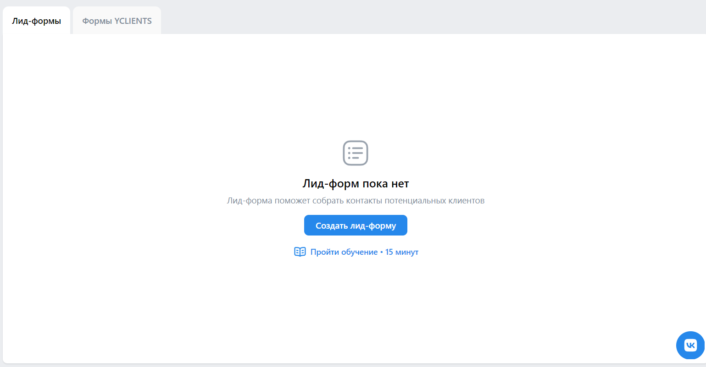

# Домашнее задание №3
## Сайты
Ссылка: https://ads.vk.com/hq/pixels

- Сайты. Основная страница. При отсутствии привязанных пикселей они не отображаются (пустой список привязанных пикселей)
- Сайты. Основная страница. Добавить пиксель. При нажатии на кнопку "Добавить пиксель" открывается форма добавления пикселя
- Сайты. Основная страница. Добавить пиксель. При переключение на ID пикселя, появляются поля ID пикселя и email владельца
- Сайты. Основная страница. Добавить пиксель. При вводе неверного имени домена (в домене должна быть хотя бы одна точка), отображается сообщение об ошибке
- Сайты. Основная страница. Добавить пиксель. При вводе верного имени домена, открывается форма с кнопками "Запросить доступ к пикселю" и "Создать новый пиксель"
- Сайты. Основная страница. Добавить пиксель. Запросить доступ к пикселю. Открывается форма запроса доступа, при вводе верной почты, запрашивается доступ к пикселю, пиксель появляется в списке со статусом "Доступ запрошен"
- Сайты. Основная страница. Добавить пиксель. ID пикселя. При вводе неверного email появляется сообщение у поля email "Неверный email"
- Сайты. Основная страница. Добавить пиксель. ID пикселя. При вводе неверного ID пикселя появляется сообщение "Счетчик не найден" у поля ID пикселя
- Сайты. Основная страница. Добавить пиксель. При нажатии на "Создать новый пиксель" открывается форма "Создан ID пикселя", после добавления домен появляется в списке 
- Сайты. Основная страница. Поиск по несуществующему имени пикселя не приносит результатов
- Сайты. Основная страница. Поиск по существуюшему имени пикселя выдает в результате данный пиксель
- Сайты. Основная страница. При нажатии на троеточие появляется список действий "Переименовать", "Удалить пиксель"
- Сайты. Основная страница. При нажатии на кнопку "Переименовать", открывается форма "Изменить название пикселя"
- Сайты. Основная страница. При нажатии на кнопку "Изменить" название пикселя меняется в спике (правда только после перезагрузки страницы:( )
- Сайты. Основная страница. При нажатии на кнопку "Удалить пиксель" открывается форма удаления пикселя, после нажатия "Удалить" пиксель пропадает из списка
- Сайты. Основная страница. При нажатии на кнопку "Настройки" открывается форма настроек
- Сайты. Основная страница. Настройки. При нажатии на кнопку "Добавить событие" открывается форма добавления события
- Сайты. Основная страница. Настройки. При нажатии на кнопку "Код пикселя" открывается форма с кодом пикселя
- Сайты. Основная страница. Настройки. При нажатии на кнопку "Аудитория сайта" открывается форма с аудиторией сайта
- Сайты. Основная страница. Настройки. При нажатии на кнопку "Аудиторные теги" открывается форма с аудиториными тегами
- Сайты. Основная страница. Настройки. Аудиторные теги. При нажатии на кнопку "Создать аудиторные тег" открывается форма с созданием аудиториного тега
- Сайты. Основная страница. Настройки. При нажатии на кнопку "Доступы" открывается форма с доступами
- Сайты. Основная страница. Настройки. Доступ. При нажатии на кнопку "Выдать доступы" открывается форма выдачи доступа

## Лид-формы
Ссылка: https://ads.vk.com/hq/leadads/leadforms

- Лид-формы. Основная Страница. Создать лид-форму. При нажатии на "Создать лид-форму" открывается форма создания лид-формы
- Лид-формы. Основная Страница. Создать лид-форму. Оформление. При нажатии на кнопку "Продолжить" у незаполненных обязателных полей появляется надпись "Обязательное поле"
- Лид-формы. Основная Страница. Создать лид-форму. Оформление. При заполнении полей он появляется в предпросмотре формы
- Лид-формы. Основная Страница. Создать лид-форму. Оформление. При заполнении формы строками, превышающими требуемую длину, появляется надпись "Превышена максимальная длина поля"
- Лид-формы. Основная Страница. Создать лид-форму. Оформление. Медиатека. При нажатии кнопки "Загрузить логотип" открывается форма "Медиатека"
- Лид-формы. Основная Страница. Создать лид-форму. Оформление. Медиатека. При нажатии кнопки "Добавить обложку" открывается форма "Медиатека"
- Лид-формы. Основная Страница. Создать лид-форму. Оформление. Медиатека. Загрузка катинок в медиатеке
- Лид-формы. Основная Страница. Создать лид-форму. Оформление. Медиатека. Стили. При нажатии на иконку выбора цвета в разделе "Cтили" открывается окно выбора цвета
- Лид-формы. Основная Страница. Создать лид-форму. Оформление. Первый экран формы. В разделе "Первый экран формы" присутствует переключение типов, с соответствующим отображением полей данного типа
- Лид-формы. Основная Страница. Создать лид-форму. Вопросы. После успешного заполнения всех обязательных полей при нажатии кнопки "Продолжить" на этапе "Оформление" происходит успешный переход на этап "Вопросы"
- Лид-формы. Вопросы. Добавление вопроса и ответов. При нажатии на кнопку "Добавить вопрос" появляются поля для конструкции вопроса
- Лид-формы. Вопросы. Добавление вопроса и ответов. При нажатии на кнопку "Добавить ответ" появляется поле для добавления варианта ответа
- Лид-формы. Вопросы. Добавление вопроса и ответов. При нажатии на кнопку "Продолжить" у незаполненных обязателных полей появляется надпись "Обязательное поле"
- Лид-формы. Вопросы. Действия с ответами. При нажатии на типа вопроса справа "Тип вопроса:" появляется список типов вопроса
- Лид-формы. Вопросы. Действия с ответами. При нажатии на три точки справа от "Добавить ответ" появляется список ответов
- Лид-формы. Вопросы. Действия с ответами. При выборе варианта ответа из списка заготовленных ответов появляется поле с этим вариантом ответа
- Лид-формы. Вопросы. Контактная информация, добавление. При нажатии кнопки "Добавить Контактная данные" появляется список типов контактной информации
- Лид-формы. Вопросы. Контактная информация, удаление. При нажатии на иконку корзины справа от типа контактной информации строка с этим типом удаляется
- Лид-формы. Результаты. После успешного заполнения всех обязательных полей при нажатии кнопки "Продолжить" на этапе "Вопросы" происходит успешный переход на этап "Результат"
- Лид-формы. Результаты. При нажатии на кнопку "Добавить сайт", "Добавить телефон","Добавить промокод" появляется поле для заполнения указанного типа информации
- Лид-формы. Результаты. При нажатии на кнопку "Продолжить" у незаполненных обязателных полей появляется надпись "Обязательное поле"
- Лид-формы. Настройки. После успешного заполнения всех обязательных полей при нажатии кнопки "Продолжить" на этапе "Результат" происходит успешный переход на этап "Настройки"
- Лид-формы. Настройки. При нажатии на кнопку "Продолжить" у незаполненных обязателных полей появляется надпись "Обязательное поле"
- Лид-формы. Настройки. Сохранение созданной формы. При нажатии "Сохранить" на этапе "Настройки" при заполнении всех обязательных полей созданная форма добавляется в список лид-форм
- Лид-формы. Основная страница. Непустой список лид-форм. При выборе одной или нескольких форм (установка галочки слева от формы) появляется кнопка "Действия", при нажатии на которую появляется список доступных действий.
- Лид-формы. Основная страница. Редактирование. При нажатии кнопки "редактировать" открывается форма редактирование лид-формы, в которой можно поэтапно изменять ее данные
