# Домашнее задание №3
## Сайты
## Ссылка: https://ads.vk.com/hq/pixels
### Сайты. Основная страница.
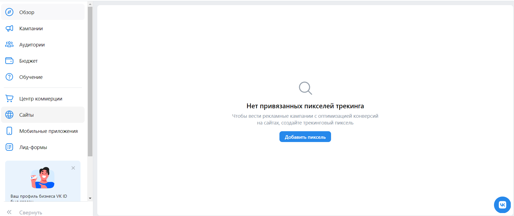
- При отсутствии привязанных пикселей они не отображаются (пустой список привязанных пикселей)
- При отсутствии привязанных пикселей появляется кнопка "Добваить пиксель"

### Сайты. Добаваить пиксель.
- При нажатии на кнопку "Добавить пиксель" открывается форма добавления пикселя

- При переключение на ID пикселя, появляются поля ID пикселя и email владельца
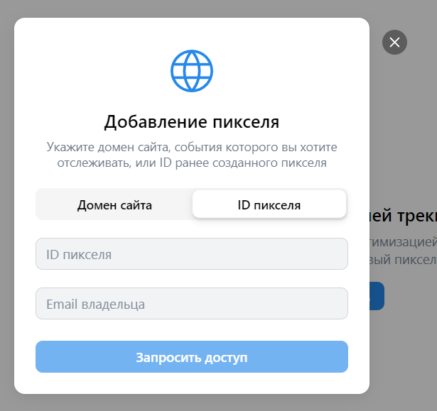
- При вводе неверного имени домена, отображается сообщение об ошибке

- При вводе верного имени домена, открывается форма с кнопками "Запросить доступ к пикселю" и "Создать новый пиксель"
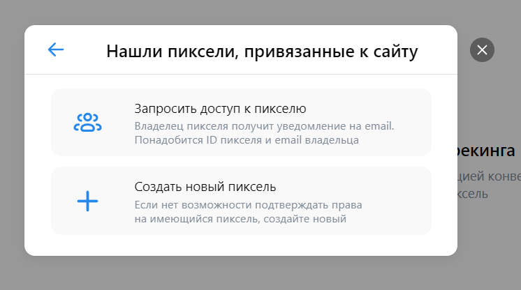
- При нажатии на "Создать новый пиксель" открывается форма "Создан ID пикселя"

- После добавления домен появляется в списке

### Сайты. Непустой список доменов.
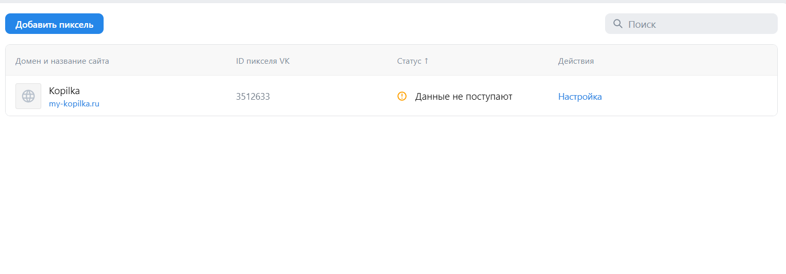
- Поиск по несуществующему имени пикселя не приносит результатов

- Поиск по существуюшему имени пикселя выдает в результате данный пиксель
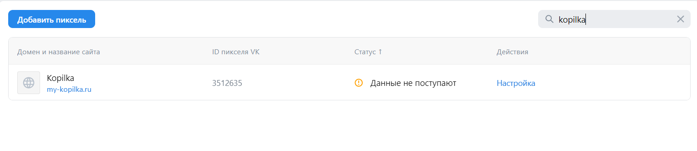
- При нажатии на троеточие появляется список действий "Переименовать", "Удалить пиксель"
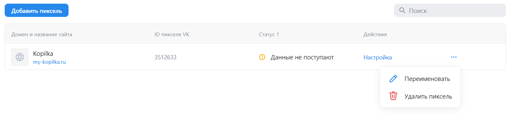
- При нажатии на кнопку "Переименовать", открывается форма "Изменить название пикселя"
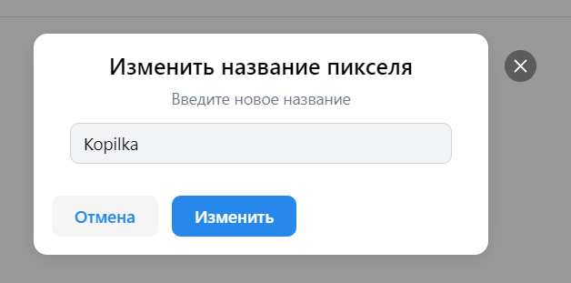
- При нажатии на кнопку "Изменить" название пикселя меняется в спике (правда только после перезагрузки страницы:( )
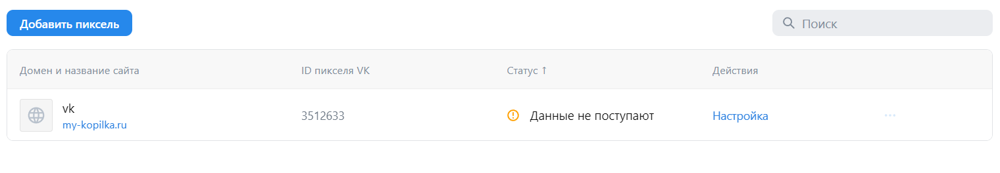
- При нажатии на кнопку "Удалить пиксель" открывается форма удаления пикселя
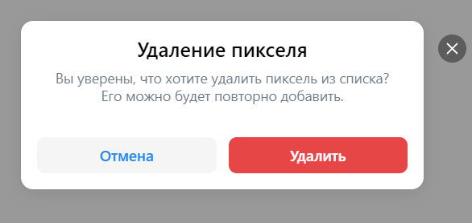
- При нажатии на кнопку "Удалить", пиксель пропадает из списка
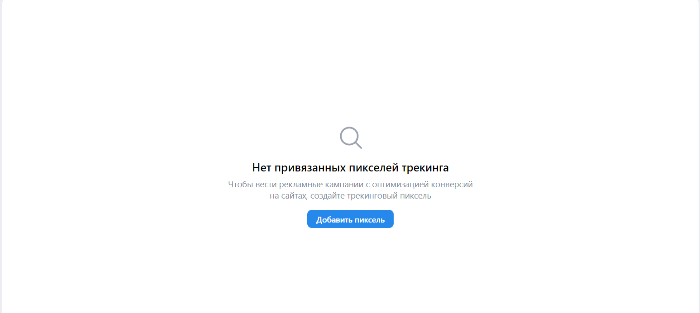

## Лид-формы
## Ссылка: https://ads.vk.com/hq/leadads/leadforms

### Лид-формы. Основная Страница
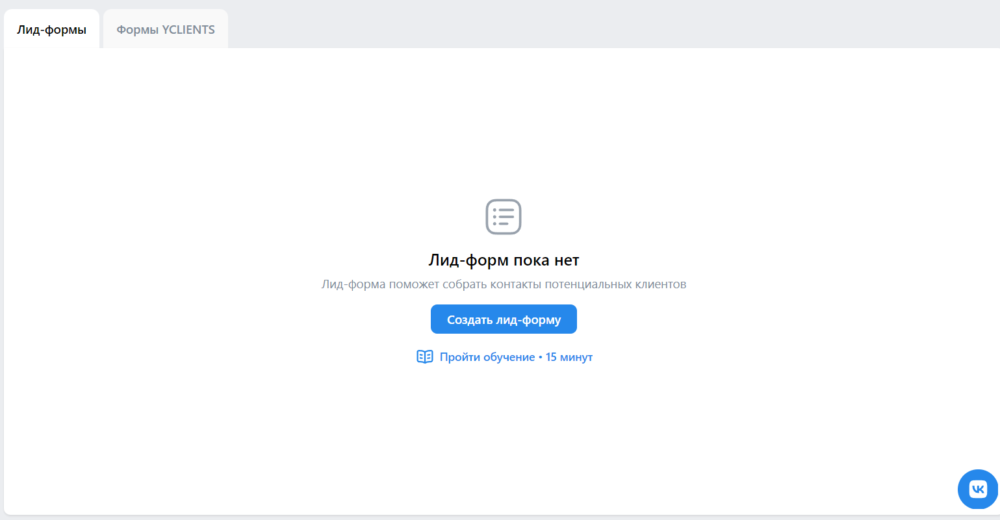
### Лид-формы. Создание
- При нажатии на "Создать лид-форму" открывается форма создания лид-формы
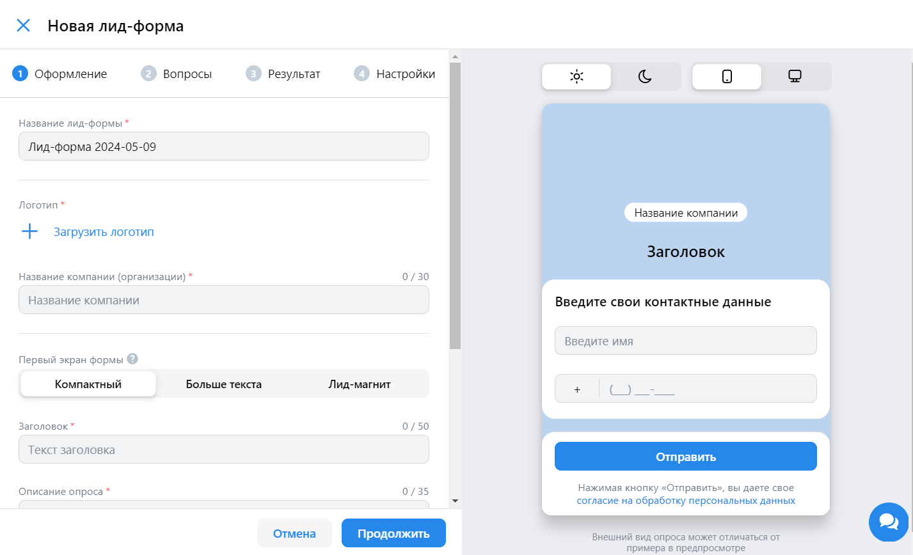
#### Лид-формы. Созданиие. Оформление
- При нажатии на кнопку "Продолжить" у незаполненных обязателных полей появляется надпись "Обязательное поле"
- При заполнении полей он появляется в предпросмотре формы
- При заполнении формы строками длинной более 255 символов появляется надпись "Превышена максимальная длина поля"

#### Лид-формы. Оформление. Медиатека
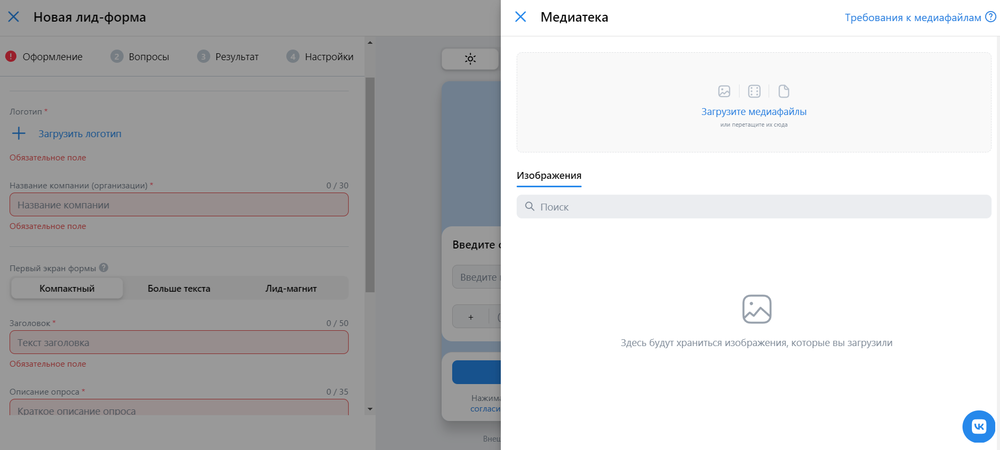
- При нажатии кнопки "Загрузить логотип" открывается форма "Медиатека"
- При нажатии кнопки "Добавить обложку" открывается форма "Медиатека"
- Загрузка катинок в медиатеке

#### Лид-формы. Оформление. Стили
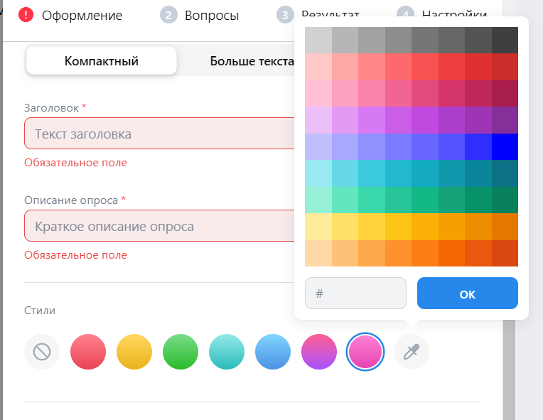
- При нажатии на иконку выбора цвета в разделе "Cтили" открывается окно выбора цвета

#### Лид-формы. Оформление. Первый экран формы
- В разделе "Первый экран формы" присутствует переключение типов, с соответствующим отображением полей данного типа
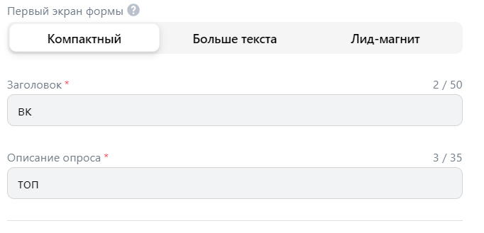
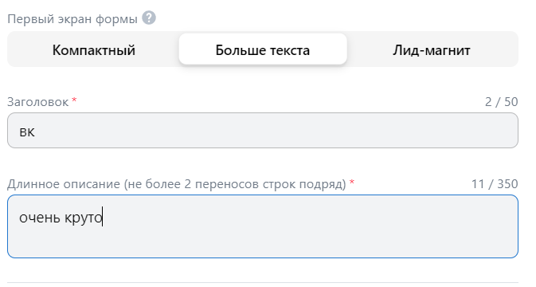
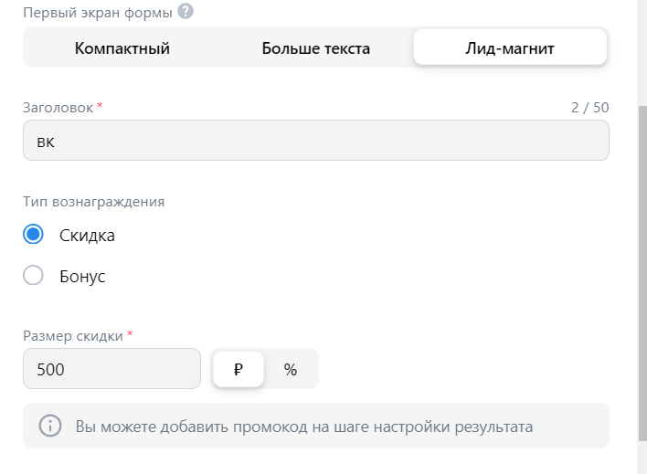

### Лид-формы. Вопросы
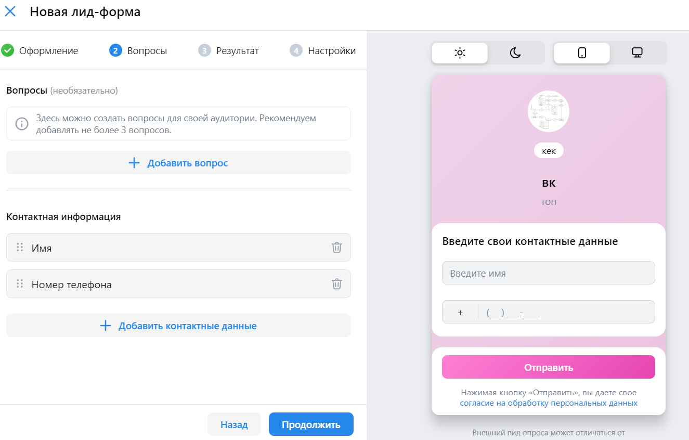
- После успешного заполнения всех обязательных полей при нажатии кнопки "Продолжить" на этапе "Оформление" происходит успешный переход на этап "Вопросы"

#### Лид-формы. Вопросы. Добавление вопроса и ответов
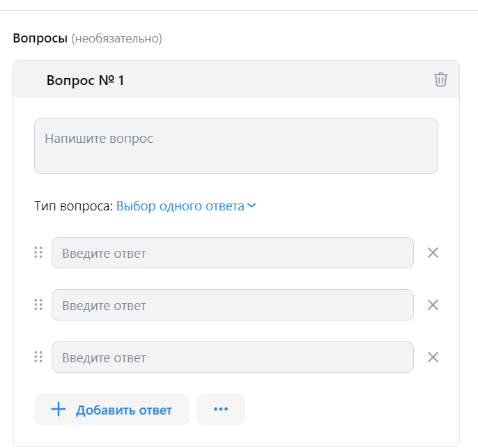
- При нажатии на кнопку "Добавить вопрос" появляются поля для конструкции вопроса
- При нажатии на кнопку "Добавить ответ" появляется поле для добавления варианта ответа
- При нажатии на кнопку "Продолжить" у незаполненных обязателных полей появляется надпись "Обязательное поле"

#### Лид-формы. Вопросы. Действия с ответами
- При нажатии на типа вопроса справа "Тип вопроса:" появляется список типов вопроса
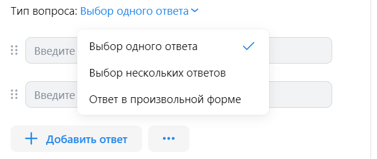
- При нажатии на три точки справа от "Добавить ответ" появляется список ответов
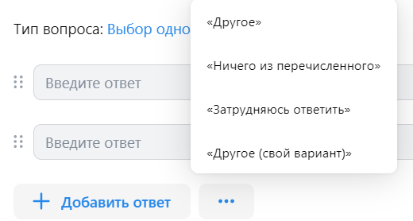
- При выборе варианта ответа из списка заготовленных ответов появляется поле с этим вариантом ответа
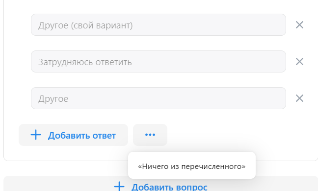

#### Лид-формы. Вопросы. Контактные информация, добавление
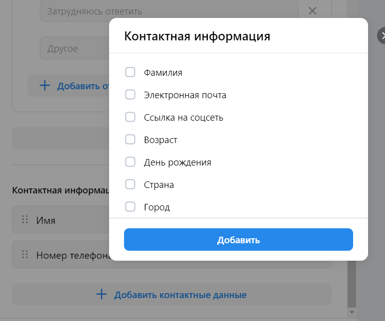
- При нажатии кнопки "Добавить контактные данные" появляется список типов контактной информации

#### Лид-формы. Вопросы. Контактные информация, удаление
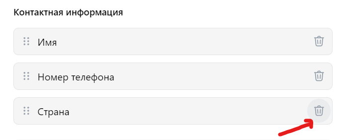
- При нажатии на иконку корзины справа от типа контактной информации строка с этим типом удаляется

### Лид-формы. Результаты.
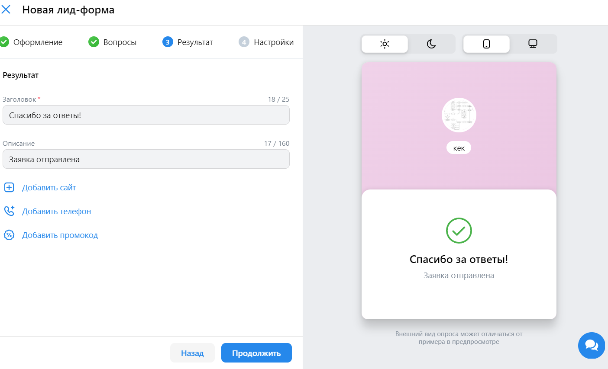
- После успешного заполнения всех обязательных полей при нажатии кнопки "Продолжить" на этапе "Вопросы" происходит успешный переход на этап "Результат"
- При нажатии на кнопку "Добавить сайт", "Добавить телефон","Добавить промокод" появляется поле для заполнения указанного типа информации
- При нажатии на кнопку "Продолжить" у незаполненных полей обязателных полей появляется надпись "Обязательное поле"

### Лид-формы. Настройки.
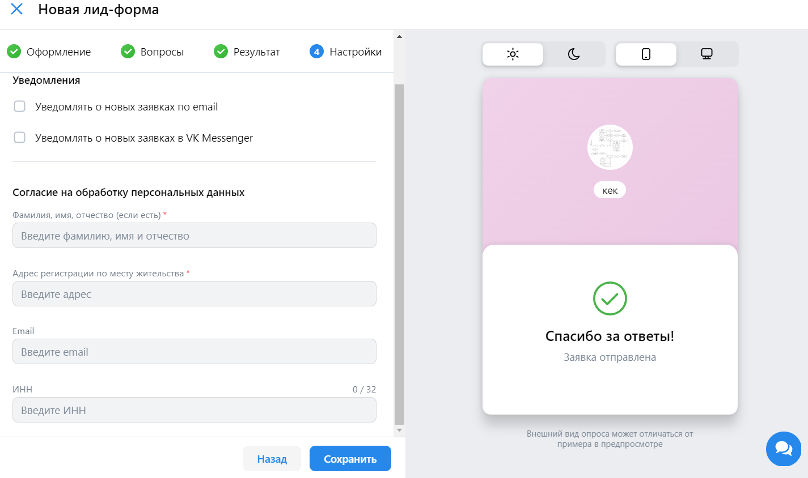
- После успешного заполнения всех обязательных полей при нажатии кнопки "Продолжить" на этапе "Результат" происходит успешный переход на этап "Настройки"
- При нажатии на кнопку "Продолжить" у незаполненных полей обязателных полей появляется надпись "Обязательное поле"

#### Лид-формы. Настройки. Сохранение созданной формы
- При нажатии "Сохранить" на этапе "Настройки" при заполнении всех обязательных полей созданная форма добавляется в список лид-форм

### Лид-формы. Основная страница. Непустой список лид-форм
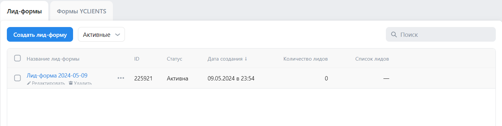
- При выборе одной или нескольких форм (установка галочки слева от формы) появляется кнопка "Действия", при нажатии на которую появляется список доступных действий.
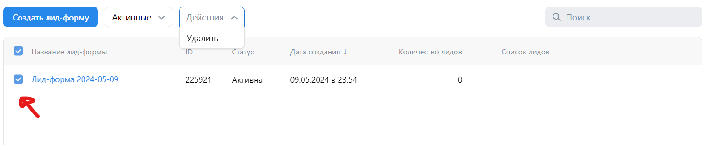

### Редактирование лид-формы
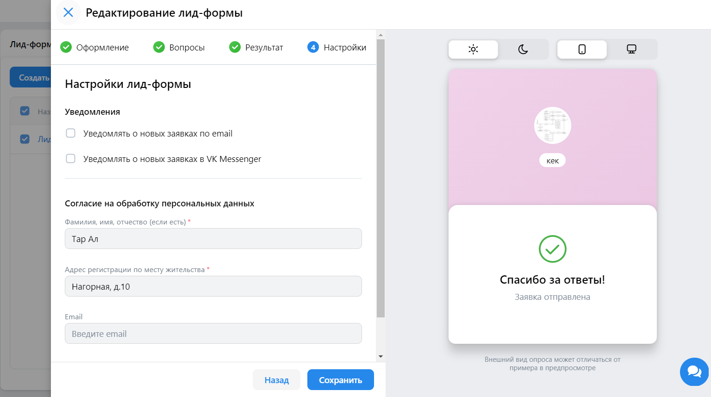
- При нажатии кнопки "редактировать" открывается форма редактирование лид-формы, в которой можно поэтапно изменять ее данные

